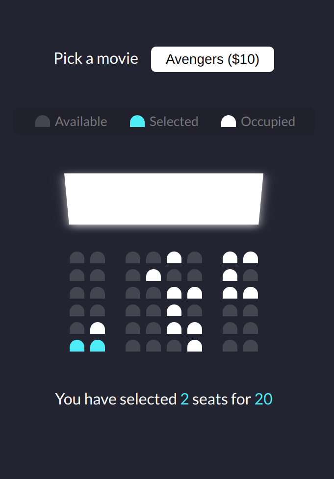

# movie-seat-booking

Mini project - movie seat booking, using vanilla JavaScript

### Functions:

[The app](https://tn-space.github.io/movie-seat-booking/)

The app let user choose a movie from the list. \
User can choose seats from the available. \
The app calculate the total amount(\$) based on chosen number of seats. \
Chosen seats aren't affected by refreshing.

### Images:

